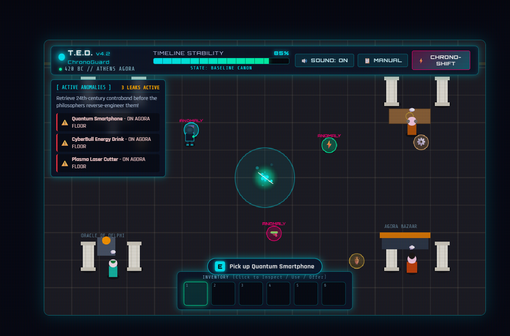
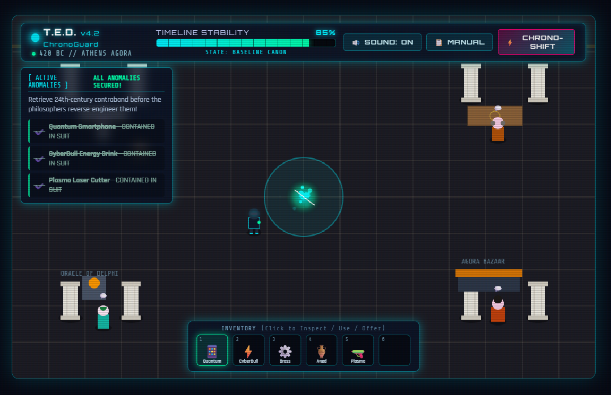
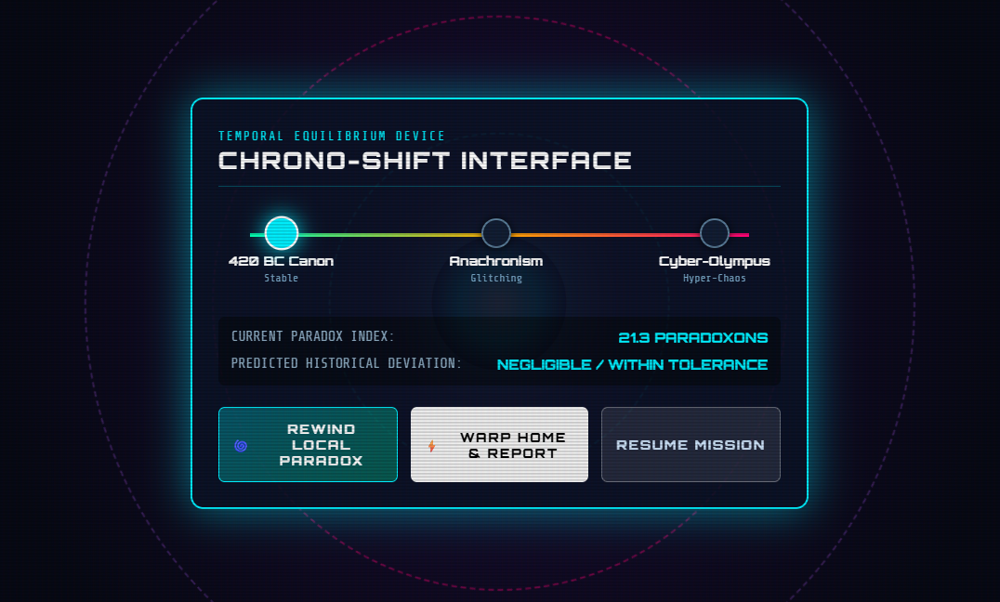

# [Don't Break the Timeline] 🎯

## Basic Details
### Team Name: Aparna V S

### Team Members
- Team Lead: Aparna V S - College of Engineering Trikaripur
  

### Project Description
Don’t Break the Timeline is a funny sci-fi adventure game where you play as Agent Chrono, a time traveler sent back to Ancient Greece to repair a broken timeline.

### The Problem (that doesn't exist)
time traveling

### The Solution (that nobody asked for)
funny game which is uselessly using energy

## Technical Details
### Technologies/Components Used
For Software:
- html, java script, css

### Project Documentation
For Software:

# Screenshots (Add at least 3)

---
Made with ❤️ at TinkerHub Useless Projects 

